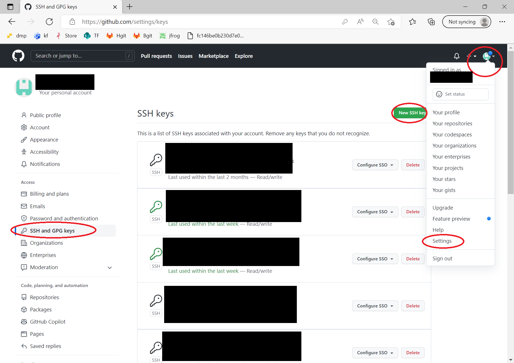
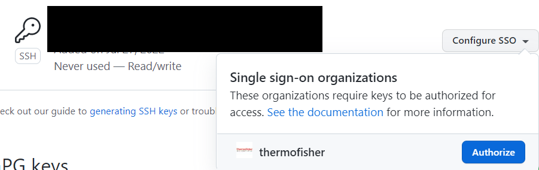
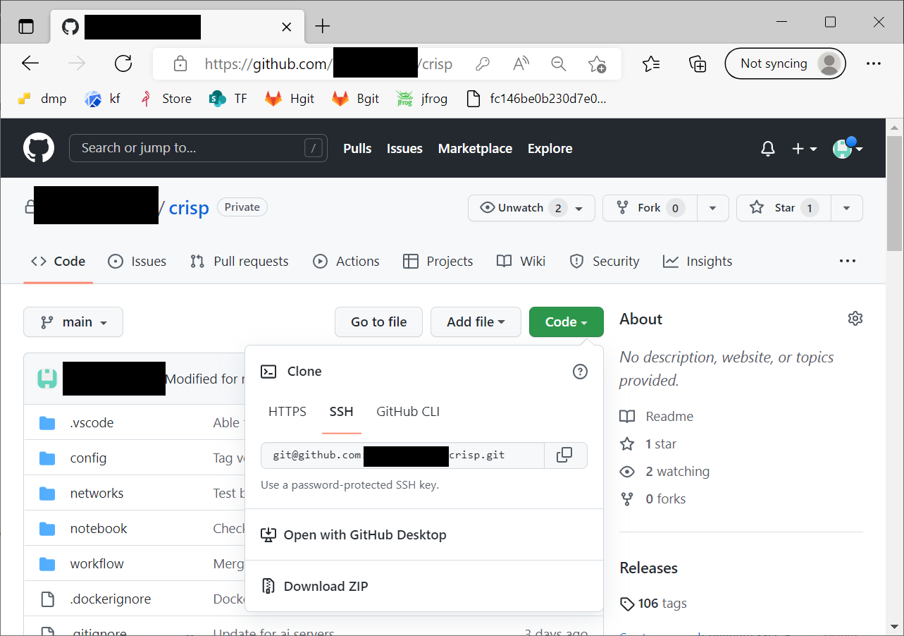
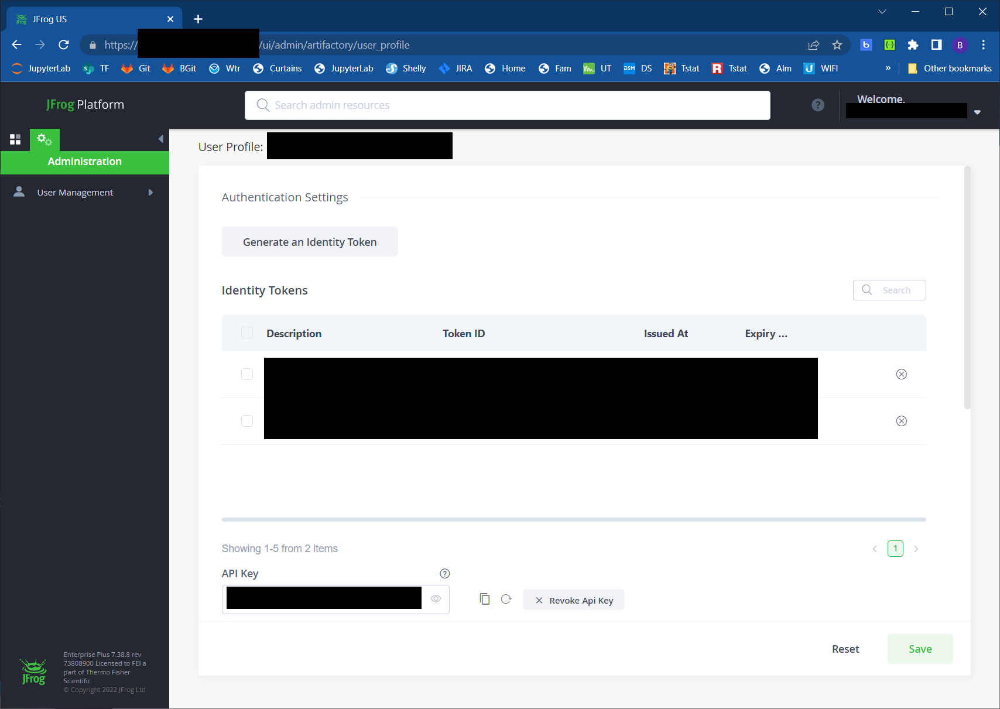

# crisp

## Getting started
A cluster administrator  must build the container image to a container registry (e.g. https://hub.docker.com/ registry).  To do this, we will clone repository, add the image to a container registry, deploy the image to a server, and prepare the image for CRISP development.  We will use ssh authentication so automated processes can automatically tag and deliver software:
1.  Generate an ssh key within the account we will create the repository:
    - [Generating a new SSH key](https://docs.github.com/en/authentication/connecting-to-github-with-ssh/generating-a-new-ssh-key-and-adding-it-to-the-ssh-agent)
        ```cmd
        ai@ml1:~/git$ ssh-keygen -t ed25519 -C "<email address>"
        ai@ml1:~/git$ cat ~/.ssh/id_ed25519.pub
        ```    
    - Add the ssh key to your github account ([GitHub SSH clone](https://www.theserverside.com/blog/Coffee-Talk-Java-News-Stories-and-Opinions/github-clone-with-ssh-keys))

1. In your github account->settings->SSH and GPG Keys, add a new SSH key
    
    - Use <username>@<computer> (e.g. jo@abacus) as the key title
    - The key value is the entire output line from 
        ```cmd
        cat ~/.ssh/id_ed25519.pub
        ```
    - Once created, selected Configure SSO and authorize the key:
        
1. Clone the CRISP project to one of the mapped volumes
    ```cmd
    git clone git@github.com:sherlj5352/crisp.git
    ```

    
    - Clone this repository
        ```cmd
        git clone https://github.com/sherlj5352/crisp.git

    - Create or reuse the credentials file for model defining docker registries, s3 object stores, and argo workflows as follows
        ```yaml
        registry:
        - name: none
        url: null
        - name: local
        url: localhost:32000

        s3:
        - name: store
        type: trainer
        address: abacus:30990
        access key: <username>
        secret key: <password>
        tls: false
        cert verify: false
        cert path: null
        sets:
            dataset: {"bucket":"imgml","prefix":"data", "dataset_filter":"" }
            trainingset: {"bucket":"imgml","prefix":"training", "dataset_filter":"" }
            model: {"bucket":"imgml","prefix":"model", "dataset_filter":"" }
            test: {"bucket":"imgml","prefix":"test", "dataset_filter":"" }

        argo:
        - name: abacus
        address: abacus:30992
        username: <username> 
        password: <password>
        tls: true
        cert verify: false
        cert path: null
        namespace: tr
        ```

1. To deploy to a JFrog registry, create an API key in the [JFrog Repository](https://jfrog.com/) (see enter the container registry credentials [JFrog Access](https://jfrog.com/) for more details).
    - Create an API key to login to the docker repository \
        a. Click on your username in upper right corner \
        b. Then click edit profile from drop down menu. \
        c. Click on the generate API Key button. \
        
    - From the command line, Username is your  email address.  Password is the API key that you generated.
        ```cmd
        docker login <login credentials>
        ```
    - Deploy the docker files with the deploy script to the registry name specified in creds.yaml:
        ```cmd
        ./deploy -registry jfrog
        ```
    - Run development container with the dr script.  With default parameters:
        ```cmd
        ./dr
        ```
        with the parameters:
        1. CONTAINER_NAME
        1. SSH_PORT
        1. UTIL_PORTS
        1. gpus: e.g. 0, "all", "device=1,3"
        1. image_name: e.g.  localhost:32000/crispdev:0.0.149

        With explicit parameters:
        ```cmd
        ./dr crispdev 32222 32201 "all"
        ```
1. User container configuration for CRISP development:
    - ssh into the container assuming server abacus.cbt and SHH_PORT 32222.  Default root password is AD-fgy65r
        ``` cmd
        ssh -p 32222 root@abacus
        ```
    - startup services, create new user, and disable root ssh access:
        ```cmd
        # Create new user
        adduser sherlj
        usermod -aG sudo sherlj

        # Disable root ssh
        sed -i "s/.*PermitRootLogin prohibit-password/PermitRootLogin no/g" /etc/ssh/sshd_config

        # exit ssh connection
        exit
        ```

    - ssh into user account:
        ```cmd
        ssh -p 32222 sherlj@abacus
        ```
    - Configure ssh access key (windows)
        1. On your development computer, generate a public/private key.  Accept default parameters.
            ``` cmd
            ssh-keygen
            ```
        1. Open C:\Users\\username\\.ssh\\id_rsa.pub 
        1. Copy all file contents
        1. In the container, past the contents of id_rsa.pub to  ~/.ssh/authorized_keys in linux.
            ```cmd
            sherlj@0c7a556d4a53:~$ mkdir ~/.ssh
            sherlj@0c7a556d4a53:~$ nano ~/.ssh/authorized_keys
            ```
        1. Press ctl+o to save the authorized_keys once you have pasted in the new key.  
        1. Pres ctl+x to exit to close nano.

    We will clone repository, add the image to a container registry, deploy the image to a server, and prepare the image for CRISP development.  We will use ssh authentication so automated processes can automatically tag and deliver software:
    1. ssh into the container:
        ```cmd
        ssh -p 32222 sherlj@abacus
        ```
    1.  Generate an ssh key within the account we will create the repository ([Generating a new SSH key](https://docs.github.com/en/authentication/connecting-to-github-with-ssh/generating-a-new-ssh-key-and-adding-it-to-the-ssh-agent)).  Press enter when prompted to accept all default settings.
        ```cmd
        ssh-keygen -t ed25519 -C "<email>"
        cat ~/.ssh/id_ed25519.pub
        ```    
    1. Add the ssh key to your github account ([GitHub SSH clone](https://www.theserverside.com/blog/Coffee-Talk-Java-News-Stories-and-Opinions/github-clone-with-ssh-keys)): 

        - In your github account->settings->SSH and GPG Keys, add a new SSH key
            
        - Use <username>@<computer> (e.g. sherlj@abacus:) as the key title
        - The key value is the entire output line from 
            ```cmd
            cat ~/.ssh/id_ed25519.pub
            ```
        - Once created, selected Configure SSO and authorize the key:
            


        - In github->settings->SSH and GPG Keys, add a new SSH key
        - Create a title and copy key from above
        - Once created, selected Configure SSO
        - Clone project to one of the mapped volumes
            ```cmd
            git clone git@github.com:sherlj5352/crisp.git
            ```
        - Configure git user
            ```cmd
            git config --global user.email "<email>"
            git config --global user.name "<user name>"
            ```

1. VSCode development
    - (Optional) install [python](https://www.python.org/downloads/) on your development computer 
    - Follow the [VS Code install](https://code.visualstudio.com/download) instructions for your operating system
    - Install the Remote Development extension
    - Install the Python extension
    - Configure SSH client connection
        1. Open the Command Pallet (View->Command Pallet)
        1. Type/select "Remote-SSH: Connect to Host"
        1. Select "+ Add new SSH Host..."
        1. Enter "ssh -p 32222 sherlj@abacus -A"
        1. Accept the default configuration file  
    - Open the CRISP project in VS Code
        1. Open the Command Pallet (View->Command Pallet)
        1. Type/select "Remote-SSH: Connect to Host
        1. Select ssh configuration created above
        1. Select Extensions->Python->Install in SSH
        1. Select Explorer->Open Folder and open CRISP from the network drive where it was installed

1. Crisp development and test
    - Open VSCode to the server container and CRISP project
    - Set up the config.yaml with credentials for the docker registry, s3 and argo workflow you will use as follows:
        ```yaml
        registry:
            - name: jfrog
              url: https://jfrog.com/

        s3:
        - name: store
          type: trainer
          address: abacus:30990
          access key: <username>
          secret key: <password>
          tls: false
          cert verify: false
          cert path: null
          sets:
            dataset: {"bucket":"imgml","prefix":"data", "dataset_filter":"" }
            trainingset: {"bucket":"imgml","prefix":"training", "dataset_filter":"" }
            model: {"bucket":"imgml","prefix":"model", "dataset_filter":"" }
            test: {"bucket":"imgml","prefix":"test", "dataset_filter":"" }

        argo:
        - name: abacus
          address: abacus:30992
          username: "" 
          password: ""
          tls: true
          cert verify: false
          cert path: null
          namespace: tr
        ```
    - Deliver and commit any changes which will be tagged by the deploy script
        ```cmd
        sherlj@965279925e33:/data1/sherlj/git/crisp$ git status
        On branch main
        Your branch is ahead of 'origin/main' by 1 commit.
        (use "git push" to publish your local commits)

        Changes not staged for commit:
        (use "git add <file>..." to update what will be committed)
        (use "git restore <file>..." to discard changes in working directory)
                modified:   README.md

        no changes added to commit (use "git add" and/or "git commit -a")
        sherlj@965279925e33:/data1/sherlj/git/crisp$ git add README.md
        sherlj@965279925e33:/data1/sherlj/git/crisp$ git commit -m "Adding development and test steps to README.md"
        [main 8cb6452] Adding development and test steps to README.md
        1 file changed, 19 insertions(+)
        sherlj@965279925e33:/data1/sherlj/git/crisp$ git push
        ```
    - Build and deploy the crisp containers with the deploy script:
        ```cmd
        ./deploy -registry jfrog
        ```

## To Do:
1. Auto-increment container numbers similar to pymlutil
1. Pick the latest container version number in ./dr
1. Pick the user port number in ./dr
1. Update dataset in minio
1. Changes in software were not being reflected in training jobs.  This appears to be a failure in docker caching.  Does this correct it?:
    ```cmd
    docker system prune -a
    ```


```cmd
echo 'export DOCKER_BUILDKIT=1' >> ~/.bashrc
. ~/.bashrc
```

