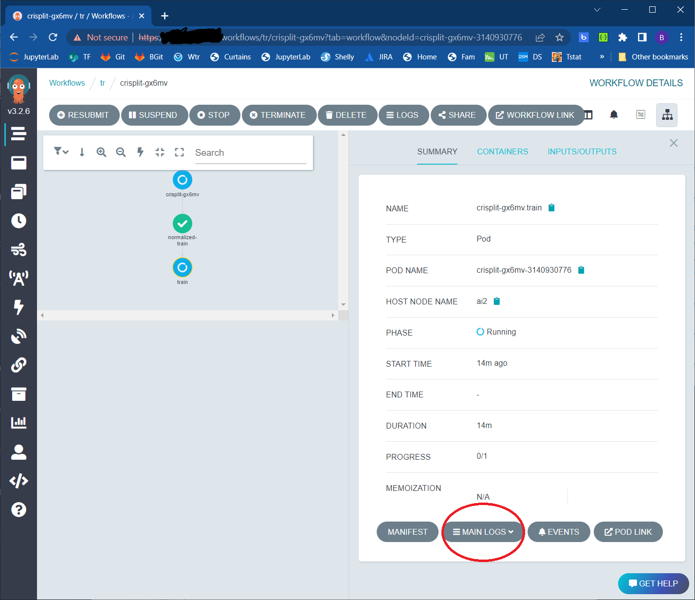
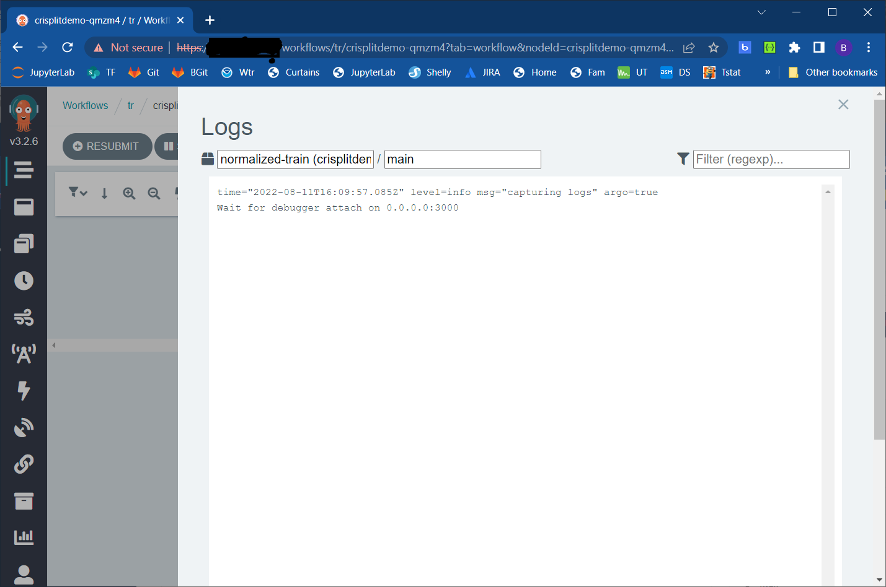
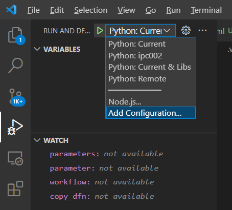

# Machine Learning Training/Test Jobs

## Introduction
Machine learning requires large datasets and significant compute hardware beyond what is fessible today in a laptop or desktop computer.  To scale machine learning to many developers, we need to have a method to share compute hardware among many users and tasks.  Workflow orchestration is one part of this taks.  Many software solutions exist to accomplish this: 
- [Orchistration Tool Comparision](https://www.datarevenue.com/en-blog/airflow-vs-luigi-vs-argo-vs-mlflow-vs-kubeflow)
- [Picking A Kubernetes Orchestrator: Airflow, Argo, and Prefect](https://medium.com/arthur-engineering/picking-a-kubernetes-orchestrator-airflow-argo-and-prefect-83539ecc69b)

I propose [Argo Workflows](https://argoproj.github.io/argo-workflows/) because it accomplishes the one task of orchestrating containers on Kubernetets very well.  Argo Workflows is an opens-source tool to create and execute machine learning jobs on a Kubernetes cluster.  This is a tutorial to create, execute, and diagnose machine learning training using Argo Workflows on abacus.  

Benefits:
1. Create and queue tests that can be executed when resources are available.  For example, I set up 4 different runs over my vacation and came back to find the answer to my question on multi-step pruning.
1. Efficiently share GPU resources on a cluster: if we slice up a bunch of GPUs within dev environments, the GPU spends most of the time idle as we are typing or debugging.  As jobs, we could keep GPU utilization maybe closer to 90%.  We will need both solutions.

## Workflow Tasks:
### Preparing container images for development & jobs
Argo sequences containers.  Containers can execute single actions as illustrated in [Daemon Containers](https://argoproj.github.io/argo-workflows/walk-through/daemon-containers/) but here I am concerned with neural network training.  For this, I add 2 docker files to my projects:
- [Training dockerfile](../dockerfile-train) performs training/test/validation as a job.  Note copy operations to copy model source code into the container.  The final command "CMD" is for stand-alone testing and will be overridden by the job.
    ```dockerfile
    ...
    ENV PYTHONUNBUFFERED=1
    COPY networks networks
    COPY creds.yaml creds.yaml

    ...

    # Launch training
    CMD ["python3","-u", "networks/cell2d.py"]
    ```
- [Development dockerfile](../dockerfile) is derived from  dockerfile-train, adds development dependencies and is run from an interactive console.  The "FROM" image is added as a parameters so it follows repository and version created from "dockerfile-train"
    ```dockerfile
    ARG IMAGE

    FROM ${IMAGE}
    ...
    ```
- Dockerfiles are build and stored in a registry accesible to argo as defined by your individual creds.yaml.  'none' stores the image only in docker for local testing.  "jfrog" is preferred to target various clusters.
    ```
    registry:
    - name: none
    url: null
    - name: local
    url: localhost:32000
    - name: jfrog
    url: https://jfrog.com/
    ```
- The deploy script builds the containers and pushes them to the target registry.  It cannot be run from within a docker container because [docker container does not run systemd](https://superuser.com/questions/1718835/docker-with-systemd-and-systemctl) needed to run docker commands.  
    ```cmd
    sherlj@abacus:~/git/crisp$ ./deploy -r jfrog
    ```

### Monitor training (logs & tensorboard)
Argo is run from Kubctl.  The Argo UI is available at [https://abacus:30992](https://abacus:30992/).  It publishes workflow data in the Minio object storage at [http://abacus:30991/](http://abacus:30991/buckets/workflows/browse).  
The "workflow.py" script preprocesses and runs workflows through the Argo REST API.

```cmd
sherlj@abacus:~/git/crisp$ py workflow.py --server abacus --run workflow/crisplitdemo.yaml --params '{"batch_size":2}'
```

The [crisplitdemo.yaml](crisplitdemo.yaml) is a multi-step training job where the initial step pretrains with an imbalanced data set and subsequent steps train, prune and test a convolutional neural network.  Each subsequent step begins with the model of the model and tensorboard of the previous step and modifies this to show and compute a mult-step training process.

The Argo [walk-through](https://argoproj.github.io/argo-workflows/walk-through/) illustrates a variety a structures that can be defined by a workflow.

The final section defines the job's resources in the Kubernetes pod syntax requesting resources, drives, and defining a retry strategy:
```yaml
...
          ports:
            - name: debug
              containerPort: 3000
              #hostPort: 3000
            - name: tensorboard
              containerPort: 6006
              hostPort: 6007
          resources:
            requests:
              ephemeral-storage: "40Gi"
              "nvidia.com/gpu": '1'
            limits:
              ephemeral-storage: "40Gi"
              "nvidia.com/gpu": '1'
          retryStrategy:
            limit: "3"
            retryPolicy: "Always"
```

### Data storage available to a job (job will appear, run, and exit so no data is stored in the job itself)
The container is loaded from the initial state at each run.  All persistent data must be loaded from and written to a storage external from the container.  This can include:
- Mounted drive
- Object storage (AWS, MINIO, [AIStore](https://github.com/NVIDIA/AIStore), ...)
- Database
- Console output

### Diagnosing failures
1. Argo UI
1. "Main Logs" is console output
    
1. kubectl describe pod

### Debugging
1. Forward debug port to from container to cluster
    ```yaml
    ...
            ports:
                - name: debug
                containerPort: 3000
                hostPort: 33000
    ...
    ```
1. Enable debug flag
    ```cmd
    sherlj@abacus:~/git/crisp$ py workflow.py --server abacus --run workflow/crisplitdemo.yaml --params '{"debug":"true"}'
    ```
1. Each container will be launched with the --debug flag and will break at startup until the debugger is attached:

1. Set breakpoints
1. Attach vscode debugger.  In visual studio code, add a new debug configuration and set the configuraiton to the docker container host and port:

  

  ```json
          {
              "name": "Python: localhost",
              "type": "python",
              "request": "attach",
              "port": 33000,
              "host": "localhost",
              "pathMappings": [
                  {
                      "localRoot": "${workspaceFolder}",
                      "remoteRoot": "."
                  }
              ],
              "justMyCode": false
          },
```

### Storing job results: trained models, Tensorboard data, Summary data
### Passing data between workflow steps
### Multi-GPU training on a cluster
### Hyperparameter tuning
### Results visualization & comparison
### Integration with S3, GIT, Kafka,  and other event systems for automated training/test
### On-line learning


A kubernetes pod definition can supply parameters to "fcn/train" the pod yaml spec.containers.args: array illustrated here:
```yaml
apiVersion: v1
kind: Pod
metadata:
  name: cl-train
  namespace: cl
spec:
  restartPolicy: OnFailure
  containers:
  - name: fcntrain
    image: registry.dmp/fcntrain:latest
    args: [--trainingset, '20210216-041925-lit-full/', --train_epochs, '2', --minio_address, '198.211.144.06:31994']
    resources:
      limits:
        ephemeral-storage: 40G
        nvidia.com/gpu: 1 # requesting 1 GPU
```
The cl/training_server and [Argo Workflows](https://argoproj.github.io/argo-workflows/) are able to launch the same fcntrain docker image customizing the args array.  Other jobs are added in the same manner.

## To Do
1. Implement RBAC security on Argo
1. Deploy to AI3
1. Deploy on AI1